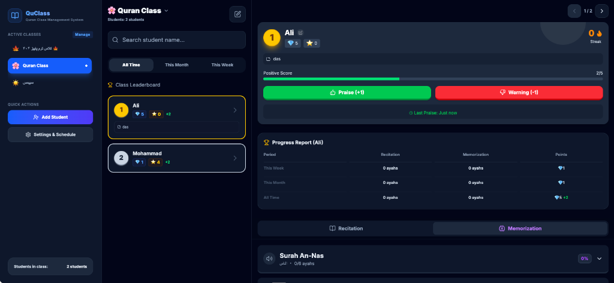
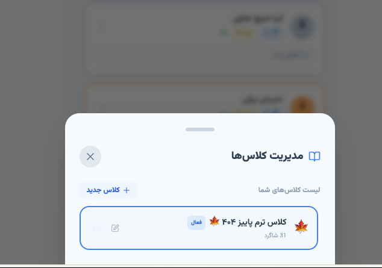

# 🕌 کلاس هوشمند قرآن کریم (QuClass)

**QuClass** یک نرم‌افزار هوشمند، مدرن و تعاملی برای مدیریت، شبیه‌سازی و ثبت فعالیت‌های آموزشی کلاس‌های قرآن کریم (روخوانی، حفظ، امتیازات و حضور و غیاب) است. این پروژه به عنوان یک برنامه پیش‌رونده وب (PWA) با طراحی راست‌چین (RTL) توسعه یافته است.




[English Readme (README.md)](./README.md)

---

## 🌟 ویژگی‌های برجسته

### ۱. مدیریت کلاس‌ها و دانش‌آموزان
*   **افزودن و ویرایش کلاس‌ها:** تعریف کلاس‌های متعدد با نام دلخواه، تاریخ شروع/پایان، و اموجی اختصاصی کلاس.
*   **آرشیو کلاس‌ها:** امکان آرشیو کردن کلاس‌های قدیمی‌تر برای خلوت نگه‌داشتن منوی فعال، با قابلیت بازیابی مجدد.
*   **ثبت پرونده شاگردان:** افزودن دانش‌آموزان همراه با یادداشت اختصاصی (مثلاً توضیحات اولیا یا اهداف فردی).

### ۲. انتقال پیشرفته شاگردان (Import)
*   امکان ایمپورت دسته جمعی دانش‌آموزان از یک کلاس به کلاس دیگر.
*   قابلیت انتخاب انتقال **همراه با سوابق** (کارهای ثبت شده قبلی، امتیازات و زنجیره‌ها) یا انتقال به عنوان **پروفایل جدید** (فقط نام و یادداشت).
*   جلوگیری هوشمند از تداخل شناسه‌ها (ID Collisions) در کلاس مقصد.

### ۳. مانیتورینگ پیشرفت دوره‌ای (هفتگی، ماهانه، کل دوره)
*   **فیلتر زمان پویا:** نمایش جدول رده‌بندی و افتخارات دانش‌آموزان بر اساس بازه‌های زمانی **این هفته**، **این ماه** یا **کل دوره**.
*   **محاسبه خودکار رشد:** رده‌بندی خودکار بر اساس تعداد آیات خوانده شده، حفظ شده و امتیازات کسب‌شده در بازه انتخابی.
*   **گزارش پیشرفت جامع:** نمودار خلاصه آماری برای هر دانش‌آموز به صورت تفکیک شده.

### ۴. سیستم پاداش‌دهی گیمیفیکیشن (Gamification)
*   **زنجیره تداوم فعالیت (Streak):** محاسبه زنجیره روزهای متوالی فعالیت فعال هر دانش‌آموز همراه با انیمیشن شعله 🔥.
*   **ارتقای خودکار جوایز:** ثبت تشویق‌ها به صورت پلاس (`+`) که در تعداد ۵ عدد تبدیل به ستاره (`⭐️`) و ستاره‌ها تبدیل به الماس (`💎`) می‌شوند.
*   **سلامت حافظه:** تخمین زمان ماندگاری محفوظات هر سوره در ذهن دانش‌آموز (سبز: تازه، زرد: متوسط، قرمز: نیاز به مرور فوری 🔄).

### ۵. پخش‌کننده صوتی و متن قرآن
*   نمایش متن کامل سوره‌ها با رسم‌الخط عثمان‌طه.
*   قابلیت پخش صوتی آیات و سوره‌ها به صورت آنلاین و آفلاین برای تمرین بهتر دانش‌آموزان.

### ۶. پشتیبانی آفلاین کامل (PWA)
*   **امتیاز ۱۰۰٪ لایت‌هاوس (Lighthouse PWA):** بهینه‌سازی شده و دارای تطابق ۱۰۰ درصدی با استانداردهای PWA لایت‌هاوس.
*   طراحی واکنش‌گرا و سازگار با موبایل و تبلت با قابلیت نصب مستقیم روی صفحه اصلی (Add to Home Screen) همراه با صفحه آغازین (Splash Screen) اختصاصی و آیکون‌های تطبیق‌پذیر (Maskable).
*   مجهز به **سرویس ورکر (Service Worker)** اختصاصی برای کش کردن فایل‌های صوتی، استایل‌ها، فونت‌های گوگل و کتابخانه‌ها جهت کارکرد بدون اینترنت.

### ۷. پشتیبانی از زبان انگلیسی و تم تاریک (Dark Mode)
*   امکان تغییر زبان کل برنامه بین **فارسی (RTL)** و **انگلیسی (LTR)** با استایل‌ها و فونت‌های هماهنگ.
*   پشتیبانی از تم‌های **روشن (Light)**، **تاریک (Dark)** و تم **سیستم (System)** با رابط کاربری مدرن و چشم‌نواز.

---

## 🛠️ ساختار فنی پروژه (Tech Stack)

*   **هسته:** React 19, TypeScript
*   **باندلر:** Vite
*   **استایل‌دهی:** Tailwind CSS (طراحی شیشه‌ای و کاملاً واکنش‌گرا)
*   **آیکون‌ها:** Lucide React
*   **پکیج تعاملی:** Canvas Confetti (برای جشن گرفتن موفقیت‌ها 🎉)
*   **پایگاه داده موقت:** LocalStorage با مهاجرت خودکار داده‌های قدیمی.
*   **تست نرم‌افزار:** Node.js native test runner با پوشش تست ۱۰۰ درصدی بخش‌های منطقی.

---

## 🚀 راه اندازی و توسعه محلی

### پیش‌نیازها
*   Node.js (نسخه ۱۸ به بالا)

### مراحل اجرا
۱. نصب وابستگی‌ها:
```bash
npm install
```

۲. اجرای پروژه در حالت توسعه:
```bash
npm run dev
```

۳. بیلد نهایی پروژه برای تولید:
```bash
npm run build
```

۴. اجرای تست‌های واحد و بررسی پوشش تست (Coverage):
```bash
# اجرای تست‌ها
npm test

# اجرای تست‌ها همراه با گزارش پوشش خطوط
npm run test:coverage
```

---

## 📦 استقرار (Deployment)

این پروژه را می‌توان به راحتی بر روی سرورهای **Vercel** یا **Netlify** مستقر کرد. فایل‌های ایستا در پوشه `dist` تولید می‌شوند و فایل‌های PWA (`manifest.json` و `sw.js`) در ریشه خروجی کپی خواهند شد.
